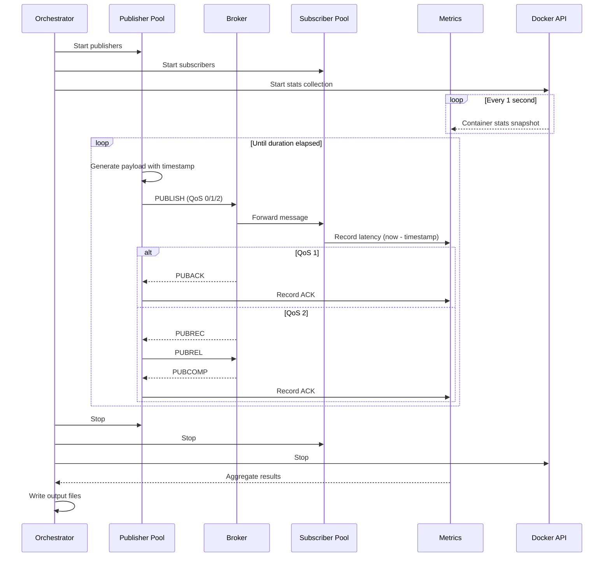

# Section 3: Architecture

## System Overview

The benchmark suite consists of three main components that operate together during a benchmark run:

```
┌─────────────────────────────────────────────────────────────────────────────┐
│                           mqtt-bench Process                                 │
├─────────────────────────────────────────────────────────────────────────────┤
│                                                                             │
│  ┌─────────────┐    ┌─────────────┐    ┌─────────────┐    ┌─────────────┐  │
│  │ Orchestrator│───▶│  Publisher  │    │  Subscriber │◀───│   Metrics   │  │
│  │             │    │    Pool     │    │    Pool     │    │  Collector  │  │
│  └──────┬──────┘    └──────┬──────┘    └──────┬──────┘    └──────┬──────┘  │
│         │                  │                  │                  │          │
│         │           ┌──────▼──────────────────▼──────┐          │          │
│         │           │         MQTT Protocol          │          │          │
│         │           └──────────────┬─────────────────┘          │          │
│         │                          │                             │          │
│         │    ┌─────────────────────┼─────────────────────┐      │          │
│         │    │                     ▼                     │      │          │
│         │    │  ┌─────────────────────────────────────┐  │      │          │
│         │    │  │           MQTT Broker               │  │      │          │
│         │    │  │         (under test)                │  │      │          │
│         │    │  └─────────────────────────────────────┘  │      │          │
│         │    │              Docker Container             │      │          │
│         │    └─────────────────────┬─────────────────────┘      │          │
│         │                          │                             │          │
│         │    ┌─────────────────────▼─────────────────────┐      │          │
│         └───▶│         Docker Engine API                 │◀─────┘          │
│              │    (container stats collection)           │                  │
│              └───────────────────────────────────────────┘                  │
│                                                                             │
└─────────────────────────────────────────────────────────────────────────────┘
                                     │
                                     ▼
                    ┌────────────────────────────────┐
                    │     Output Files               │
                    │  • results.json                │
                    │  • results.csv                 │
                    │  • container-stats.csv         │
                    └────────────────────────────────┘
```

*Figure 3-1: System architecture overview*

## Component Responsibilities

### Orchestrator

The orchestrator coordinates the benchmark lifecycle:

1. Parse CLI arguments and validate configuration
2. Initialize metrics collectors
3. Spawn publisher and subscriber pools based on scenario
4. Start container stats collection (if Docker container specified)
5. Execute warmup period (metrics discarded)
6. Execute measurement period
7. Signal graceful shutdown
8. Aggregate and output results

### Publisher Pool

The publisher pool manages multiple concurrent MQTT publisher clients:

- Each publisher maintains its own MQTT connection
- Publishers send messages at a configured rate (msg/s)
- Messages contain embedded timestamps for latency measurement
- Topic assignment varies by scenario (see [Section 4](./04-scenarios.md))

### Subscriber Pool

The subscriber pool manages multiple concurrent MQTT subscriber clients:

- Each subscriber maintains its own MQTT connection
- Subscribers extract timestamps and record latency on message receipt
- Subscription patterns vary by scenario

### Metrics Collector

The metrics collector aggregates data from all clients:

- **Throughput counters** — Atomic counters for sent/received/acked messages
- **Latency histogram** — HDR histogram with 1µs to 10s range
- **Container stats** — Time-series of CPU/memory/network from Docker API

### Docker Stats Collector

A dedicated task polls the Docker Engine API for container metrics:

- Configurable polling interval (default: 1 second)
- Collects CPU usage, memory usage, network bytes in/out
- Runs in parallel with benchmark execution

## Data Flow



*Figure 3-2: Benchmark execution sequence*

## Concurrency Model

The tool uses async/await with a multi-threaded runtime:

- **Runtime**: Tokio with work-stealing scheduler
- **Publishers**: Each runs in its own async task
- **Subscribers**: Each runs in its own async task
- **Metrics**: Lock-free atomics for counters, mutex-protected histogram
- **Docker stats**: Dedicated async task with interval timer

## Connection Management

Each MQTT client (publisher or subscriber) maintains:

- Persistent TCP connection to broker
- Automatic reconnection on disconnect (configurable retry limit)
- Keep-alive interval (default: 30 seconds)
- Clean session (no persistent state)

> **Note:** For accurate benchmarking, all connections SHOULD be established before the measurement period begins.
