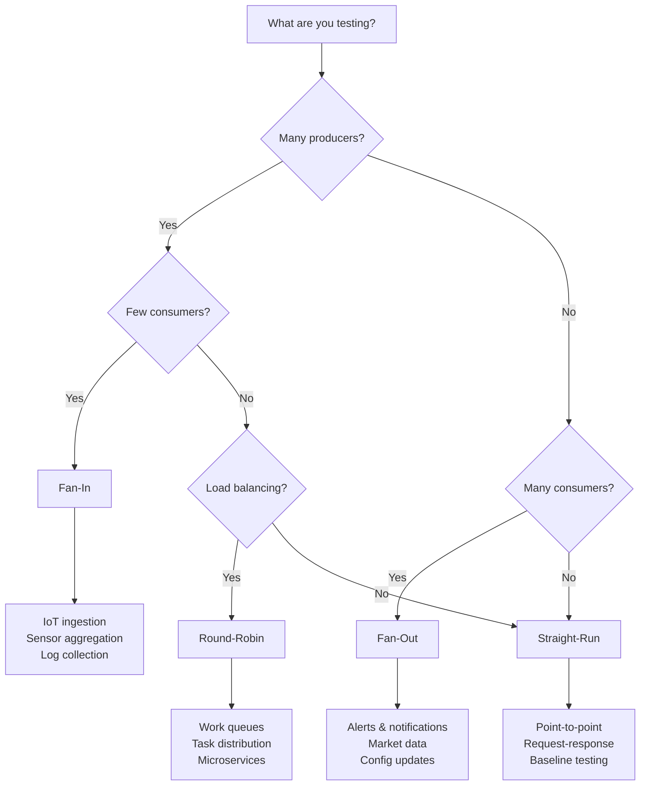

# Section 4: Benchmark Scenarios

## Overview

This specification defines four benchmark scenarios that represent common MQTT traffic patterns. Each scenario configures publisher and subscriber counts, topic distribution, and subscription patterns differently.

| Scenario | Publishers | Subscribers | Use Case |
|----------|------------|-------------|----------|
| Fan-In | Many | Few | IoT sensor ingestion |
| Fan-Out | Few | Many | Alert broadcast |
| Straight-Run | Equal | Equal | Point-to-point messaging |
| Round-Robin | Many | Many | Work queue distribution |

## 4.1 Fan-In Scenario

### Description

Many publishers send messages to a small number of subscribers. This simulates IoT deployments where thousands of sensors report to a few aggregation services.

### Traffic Pattern

```
                              ┌─────────────┐
    ┌──────────┐              │             │
    │ Pub 1    │──── topic/1 ─┤             │
    └──────────┘              │             │
    ┌──────────┐              │             │     ┌──────────┐
    │ Pub 2    │──── topic/1 ─┤             ├────▶│  Sub 1   │
    └──────────┘              │             │     │ topic/+  │
    ┌──────────┐              │   Broker    │     └──────────┘
    │ Pub 3    │──── topic/2 ─┤             │
    └──────────┘              │             │     ┌──────────┐
    ┌──────────┐              │             ├────▶│  Sub 2   │
    │ Pub 4    │──── topic/2 ─┤             │     │ topic/+  │
    └──────────┘              │             │     └──────────┘
         ⋮                    │             │
    ┌──────────┐              │             │
    │ Pub N    │──── topic/M ─┤             │
    └──────────┘              └─────────────┘

    N publishers >> M subscribers
    Publishers distributed round-robin across topics
    Subscribers use wildcard to receive from multiple topics
```

*Figure 4-1: Fan-in traffic pattern*

### Configuration

| Parameter | Default | Description |
|-----------|---------|-------------|
| publishers | 1000 | Number of publisher clients |
| subscribers | 10 | Number of subscriber clients |
| topics | 100 | Number of topics |

### Topic Assignment

- Publishers are assigned topics using round-robin: `publisher_id % topics`
- Each subscriber subscribes to `bench/topic/+` (wildcard)
- Expected messages per subscriber: `(publishers × rate × duration) / subscribers`

### Measured Characteristics

- Broker's ability to handle many inbound connections
- Message fan-in aggregation performance
- Memory pressure from many client sessions

---

## 4.2 Fan-Out Scenario

### Description

Few publishers broadcast messages to many subscribers. This simulates alert systems, market data feeds, or push notification services.

### Traffic Pattern

```
                              ┌─────────────┐
                              │             │     ┌──────────┐
                              │             ├────▶│  Sub 1   │
    ┌──────────┐              │             │     └──────────┘
    │ Pub 1    │──── topic/* ─┤             │     ┌──────────┐
    └──────────┘              │             ├────▶│  Sub 2   │
                              │   Broker    │     └──────────┘
    ┌──────────┐              │             │     ┌──────────┐
    │ Pub 2    │──── topic/* ─┤             ├────▶│  Sub 3   │
    └──────────┘              │             │     └──────────┘
                              │             │          ⋮
                              │             │     ┌──────────┐
                              │             ├────▶│  Sub N   │
                              └─────────────┘     └──────────┘

    M publishers << N subscribers
    Publishers send to all topics
    All subscribers use wildcard subscription
```

*Figure 4-2: Fan-out traffic pattern*

### Configuration

| Parameter | Default | Description |
|-----------|---------|-------------|
| publishers | 10 | Number of publisher clients |
| subscribers | 1000 | Number of subscriber clients |
| topics | 10 | Number of topics |

### Topic Assignment

- Publishers cycle through all topics: `topic_id = msg_count % topics`
- All subscribers subscribe to `bench/topic/#` (multi-level wildcard)
- Each message is delivered to ALL subscribers

### Measured Characteristics

- Broker's ability to replicate messages to many subscribers
- Outbound bandwidth and connection handling
- Memory efficiency for subscription matching

---

## 4.3 Straight-Run Scenario

### Description

Equal numbers of publishers and subscribers with 1:1 topic mapping. This represents point-to-point messaging or request-response patterns.

### Traffic Pattern

```
    ┌──────────┐              ┌─────────────┐              ┌──────────┐
    │ Pub 1    │─── topic/1 ──┤             ├── topic/1 ──▶│  Sub 1   │
    └──────────┘              │             │              └──────────┘
    ┌──────────┐              │             │              ┌──────────┐
    │ Pub 2    │─── topic/2 ──┤   Broker    ├── topic/2 ──▶│  Sub 2   │
    └──────────┘              │             │              └──────────┘
    ┌──────────┐              │             │              ┌──────────┐
    │ Pub 3    │─── topic/3 ──┤             ├── topic/3 ──▶│  Sub 3   │
    └──────────┘              │             │              └──────────┘
         ⋮                    │             │                   ⋮
    ┌──────────┐              │             │              ┌──────────┐
    │ Pub N    │─── topic/N ──┤             ├── topic/N ──▶│  Sub N   │
    └──────────┘              └─────────────┘              └──────────┘

    N publishers = N subscribers = N topics
    Perfect 1:1 mapping
```

*Figure 4-3: Straight-run traffic pattern*

### Configuration

| Parameter | Default | Description |
|-----------|---------|-------------|
| publishers | 100 | Number of publisher clients |
| subscribers | 100 | Number of subscriber clients |
| topics | 100 | Number of topics (MUST equal publishers and subscribers) |

### Topic Assignment

- Publisher N publishes exclusively to `bench/topic/N`
- Subscriber N subscribes exclusively to `bench/topic/N`
- Each topic has exactly one publisher and one subscriber

### Measured Characteristics

- Baseline broker performance with minimal routing overhead
- Per-connection throughput ceiling
- Topic matching efficiency for exact subscriptions

---

## 4.4 Round-Robin Scenario

### Description

Multiple publishers send to all topics, while subscribers use MQTT 5.0 shared subscriptions for load-balanced message distribution. This simulates work queue patterns.

### Traffic Pattern

```
                              ┌─────────────┐
    ┌──────────┐              │             │
    │ Pub 1    │──┬─ topic/* ─┤             │
    └──────────┘  │           │             │
    ┌──────────┐  │           │             │
    │ Pub 2    │──┼─ topic/* ─┤             │     ┌─────────────────────┐
    └──────────┘  │           │   Broker    │     │ $share/benchgroup/# │
    ┌──────────┐  │           │             │     ├─────────────────────┤
    │ Pub 3    │──┼─ topic/* ─┤             ├────▶│ Sub 1 ← msg A       │
    └──────────┘  │           │             │     │ Sub 2 ← msg B       │
         ⋮        │           │             │     │ Sub 3 ← msg C       │
    ┌──────────┐  │           │             │     │   ⋮                 │
    │ Pub N    │──┴─ topic/* ─┤             │     │ Sub N ← msg X       │
    └──────────┘              └─────────────┘     └─────────────────────┘

    All publishers publish to all topics
    Subscribers use shared subscription for load balancing
    Each message delivered to exactly ONE subscriber
```

*Figure 4-4: Round-robin traffic pattern*

### Configuration

| Parameter | Default | Description |
|-----------|---------|-------------|
| publishers | 100 | Number of publisher clients |
| subscribers | 100 | Number of subscriber clients |
| topics | 10 | Number of topics |

### Topic Assignment

- All publishers cycle through all topics
- All subscribers subscribe to `$share/benchgroup/bench/topic/#`
- Broker distributes each message to exactly one subscriber in the group

### Requirements

> **Note:** This scenario REQUIRES MQTT 5.0 shared subscription support. Brokers that only support MQTT 3.1.1 will fail this scenario.

### Measured Characteristics

- Shared subscription load-balancing efficiency
- Work distribution fairness across subscribers
- Broker overhead for maintaining subscription groups

---

## Scenario Selection Guide



*Figure 4-5: Scenario selection decision tree*
